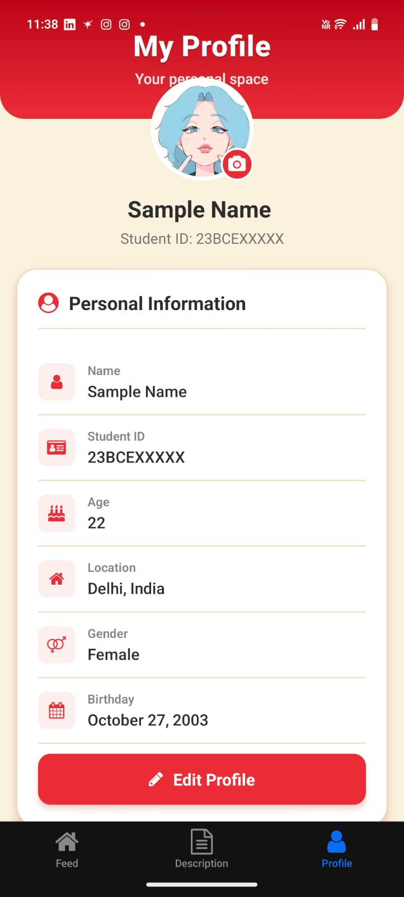
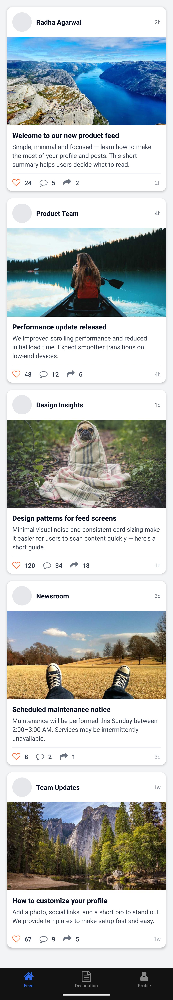
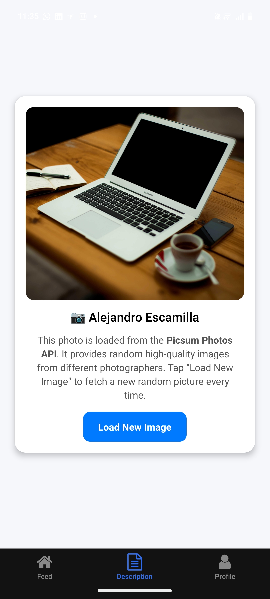
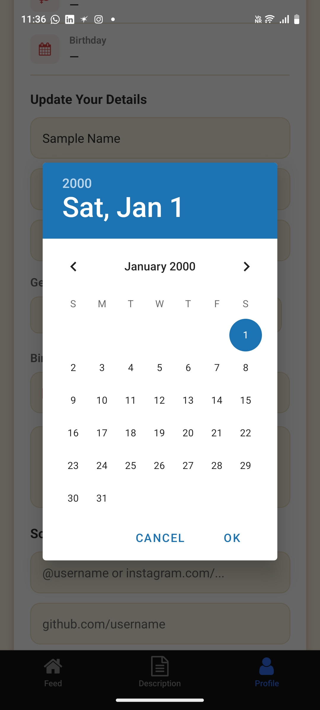
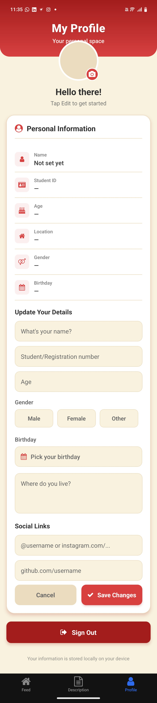

# TaskApp 📱 - React Native Task Management Application

A modern React Native task management application built with Expo, featuring intuitive UI, profile management, and task organization.


## ✨ Features

- **Task Management** - Create, organize, and track tasks
- **User Profiles** - Personalized user profiles and settings
- **Explore Feed** - Browse tasks and activities
- **Date Picker** - Intuitive date selection for task scheduling
- **Themed UI** - Beautiful dark/light mode support
- **Cross-Platform** - Works on iOS, Android, and Web
- **Async Storage** - Local data persistence
- **Gesture Support** - Smooth gesture-based interactions
- **Reanimated Animations** - High-performance animations

## 📸 Screenshots

### User Profile Screen
<p align="center">
  
  <br>
  <em>Personalized user profile interface</em>
</p>

### Task Feed Screen
<p align="center">
  
  <br>
  <em>Browse and manage your tasks feed</em>
</p>

### Description Screen
<p align="center">
  
  <br>
  <em>Detailed task descriptions and information</em>
</p>

### Date Picker Interface
<p align="center">
  
  <br>
  <em>Easy date selection for task scheduling</em>
</p>

### Profile Setup
<p align="center">
  
  <br>
  <em>Initial profile setup and configuration</em>
</p>

## 🚀 Getting Started

### Prerequisites

- Node.js (v18 or newer)
- npm or yarn
- Expo CLI
- Android Studio / Xcode (for native builds)
- Expo Go app (for testing on physical devices)

### Installation

1. **Clone the repository**
   ```bash
   git clone https://github.com/ravine27/taskapp.git
   cd taskapp
